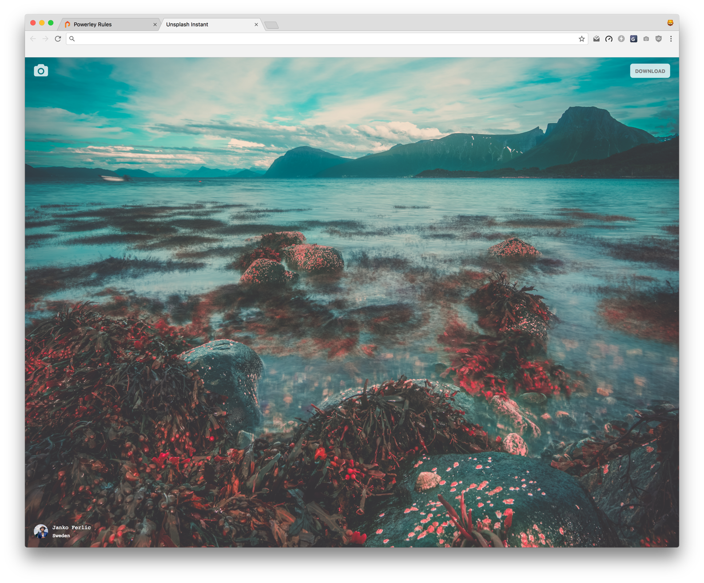

# custom-unsplash-new-tab

remade the unsplash new tab chrome extension.

mostly made for a blog post on Learn.co

uses the fetch api which is currently **NOT** available in Safari (works on macOS on TP)

# Screenshot

