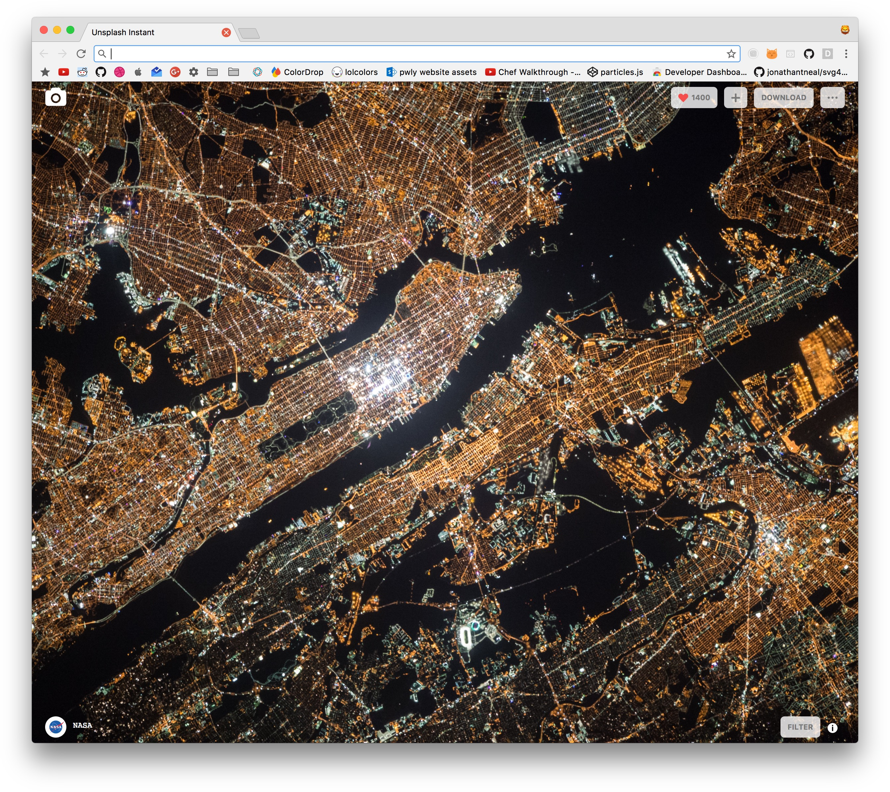

# custom-unsplash-new-tab

remade the unsplash new tab chrome extension. mostly to get experienced using fetch and api's.

uses the fetch api which is currently available in Chrome and Safari (10.1+)[only chrome and opera can use the extension]

## How to Install
1. There are 2 ways of installing this chrome extension

    1. you grab it from the [webstore](https://chrome.google.com/webstore/detail/custom-unsplash-instant/jakkljefkjcncpdibfmogcbdhonbiplp)

    2. or build from [source](https://github.com/mcansh/unsplash-new-tab/releases/latest)

2. Open the new tab extension directly
  1. open dev tools and type `location.href`
  2. copy and paste it into the omnibar
3. Copy the `?code=youraccesstokenrequesthere` from the other page
4. Paste it after `chrome-extension://chrome-extension-id-here/index.html[the code goes right here]`

## Development
1. Clone/Fork the Repo

2. install node modules: `$ yarn`

3. run webpack: `$ yarn build`

4. you're now off to the races!

5. (optional) CodeKit for compiling SASS, and Jade(Pug)

### Screenshot

